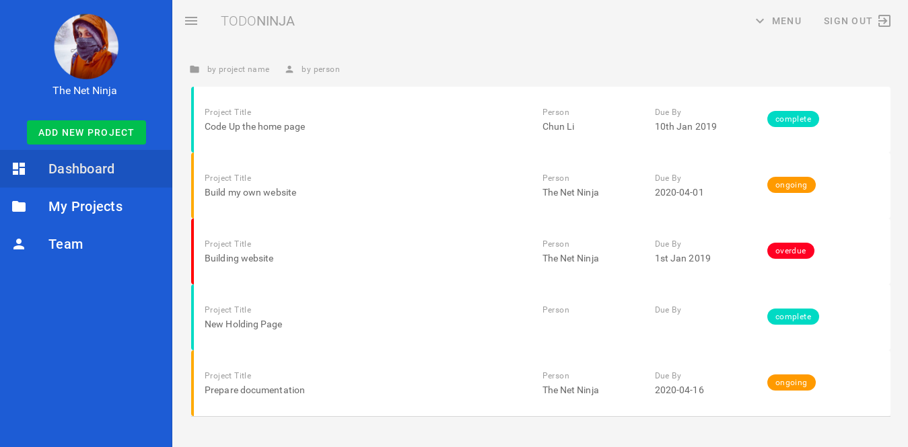
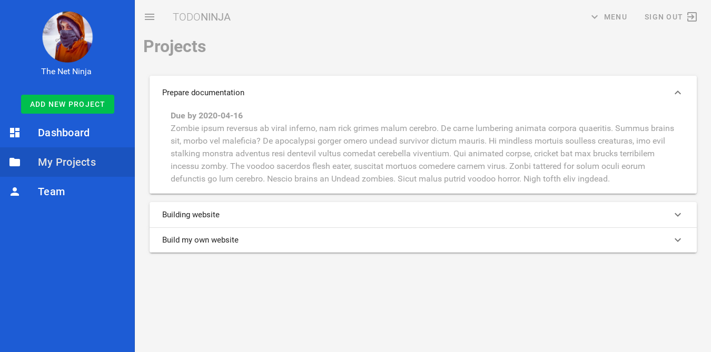
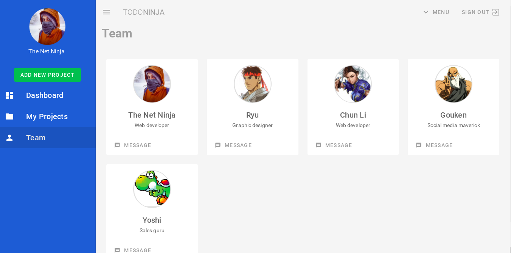
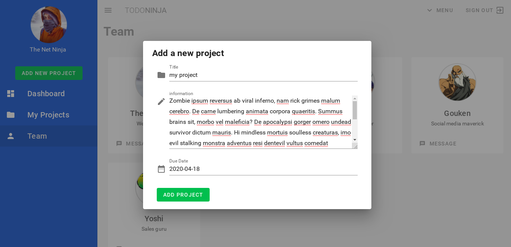

# TodoNinja

A project to learn Vuetify from the youtube playlist [Vuetify Tutorial](https://www.youtube.com/watch?v=zrfeO1Uwiws&list=PL4cUxeGkcC9g0MQZfHwKcuB0Yswgb3gA5) by [The Net Ninja](https://www.youtube.com/channel/UCW5YeuERMmlnqo4oq8vwUpg)

## Dashboard

## Projects

## Team

## Add project

## To do

- Edit/delete project
- Authentification
- Statistics on projects
